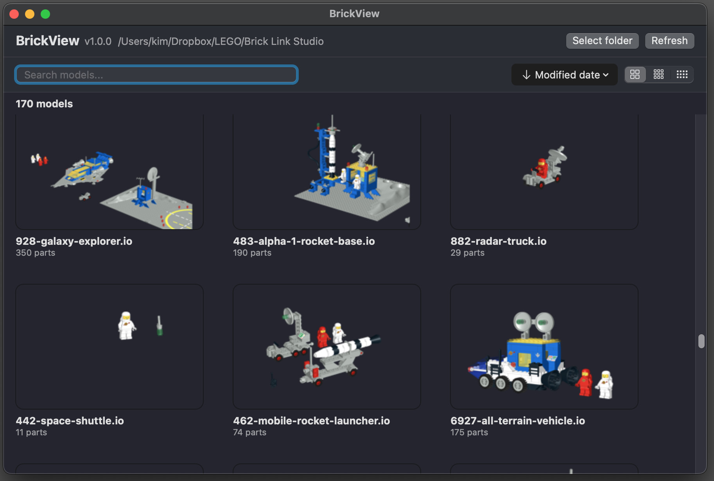

# BrickView

BrickView is a native macOS browser for BrickLink Studio `.io` files.



Browse your Studio model collection, preview models with generated thumbnails, search and sort files, and keep track of changes in your model folder — without needing to open BrickLink Studio.

## Features

- Browse BrickLink Studio `.io` files
- Generate and cache model thumbnails
- Search models with wildcard support
- Sort by:
  - File name
  - Created date
  - Modified date
- Small, Medium, and Large grid density
- Automatic folder monitoring
- Manual Refresh fallback
- Remember the selected folder
- Remember window size and position
- Custom BrickView context menu
- Native macOS interface
- Universal build for Intel and Apple Silicon

## Requirements

- macOS
- BrickLink Studio is **not required** to browse and preview `.io` files.

## Installation

Download the latest release from the [GitHub Releases](https://github.com/devindazzle/BrickView-Mac/releases) page.

### DMG

The recommended installation method is the DMG:

1. Download `BrickView-<version>-macOS.dmg`.
2. Open the DMG.
3. Drag `BrickView.app` to your Applications folder.
4. Launch BrickView from Applications.

### ZIP

A ZIP version is also available:

1. Download `BrickView-<version>-macOS.zip`.
2. Extract the ZIP archive.
3. Move `BrickView.app` to your Applications folder.
4. Launch BrickView from Applications.

BrickView releases are signed with Apple Developer ID and notarized by Apple.

## Getting Started

Launch BrickView and select the folder containing your BrickLink Studio `.io` files.

BrickView scans the selected folder and displays the available models.

Use the search field to filter models and the sorting controls to change their order.

BrickView automatically monitors the selected folder for changes and updates the model browser when files are added, modified, renamed, or removed.

## Search

BrickView supports wildcard-based searching.

A search without a wildcard matches the search text anywhere in the filename:

```text
castle
